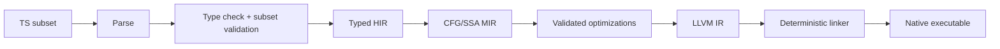

# TSNative Compiler Toolchain Plan

**Project identity:** TSNative

**Positioning:** TypeScript to native machine code

**CLI:** `tsnative`

## 1. Goal and Non-Goals

Build `tsnative`, an ahead-of-time compiler for a deliberately specified TypeScript subset that emits native executables without Node.js, V8, a JavaScript interpreter, or a tracing garbage collector.

The first release optimizes for semantic clarity and a working end-to-end compiler, not broad JavaScript compatibility. “Zero-runtime” means no language VM or GC; a small statically linked support library for process startup, output, and allocation is allowed where the selected feature requires it.

Out of scope for the MVP:

- `any`, dynamic property creation, `eval`, dynamic `import()`, `Proxy`, `Reflect`, and general reflection
- JavaScript prototype mutation and full ECMAScript coercion behavior
- exceptions, generators, promises, threads, networking, WebGPU, AI SDKs, and fluid/cloud execution
- byte-identical binaries across TypeScript, Go, and Rust

The Go/Rust comparison suite should initially compare defined program outputs and exit behavior. Identical machine code is not a realistic semantic requirement across independent compilers and should only become a separate experiment after the native pipeline is stable.

### North-star decisions

| Decision | Initial choice | Revisit when |
|---|---|---|
| Language semantics | A documented, statically typed TS subset | The core differential suite is stable |
| Numeric model | `number` is IEEE-754 `f64`; integers are explicit | Integer-heavy workloads justify more types |
| Semantic oracle | MIR evaluator | Native execution agrees across the fixture suite |
| Backend | LLVM/Clang | The backend-neutral MIR and determinism gates pass |
| Allocation | Stack first; arena/program-lifetime allocation next | Real ownership requirements appear |
| Async and errors | Rejected in MVP | A concrete executor/error ABI is specified |
| Portability | One host target, then target triples | Host build is reproducible |

These decisions are binding for MVP implementation. A feature that conflicts with them becomes a later proposal, not an implicit expansion of the subset.

## 2. MVP Contract

### Supported source subset

- Explicit `number` semantics: use IEEE-754 `f64` by default; introduce an explicit integer type rather than silently treating `number` as `i64`.
- `boolean`, fixed-size tuples/records, local variables, functions, recursion, `if`, `switch`, and loops.
- Arithmetic, comparisons, strict equality for supported types, and explicit conversions only.
- Statically resolved modules and imports.
- A narrow `console.log`/`print` intrinsic for deterministic text output.
- Optional fixed-size arrays if they can remain stack allocated.

### Rejected with diagnostics

Every unsupported construct must fail during subset validation with a stable diagnostic code and source span. Do not silently lower a construct to a different meaning.

### Initial target

Support one host target first: the host machine’s architecture and OS, preferably macOS ARM64 in this workspace. Add Linux x86_64 as the first cross target after the local pipeline is reliable. Use target triples throughout the compiler so later targets do not require an architectural rewrite.

### MVP acceptance fixture

The MVP is one vertical slice, not a collection of disconnected compiler libraries. The acceptance fixture is Fibonacci plus negative cases for unsupported syntax. Every milestone must preserve these checks:

```text
source -> diagnostics -> typed HIR -> MIR -> MIR evaluation
  -> LLVM IR -> native executable -> expected stdout/exit code
```

## 3. Recommended Architecture

Use Rust for the compiler and a small Rust or C `tsnative-support` library. Start with LLVM/Clang as an external backend for mature native code generation and target support. Keep the compiler’s own typed IR independent of LLVM so Cranelift can be evaluated later without changing language semantics.



Suggested repository shape:

```text
crates/
  cli/          tsnative build, check, run, emit-ir
  syntax/       parser and source spans
  typecheck/    symbol/type resolution and subset rules
  hir/          typed high-level representation
  mir/          typed CFG/SSA representation
  lower/        AST/HIR -> MIR and closure-free MVP lowering
  optimize/     deterministic, semantics-preserving passes
  codegen/      MIR -> LLVM IR
  driver/       target selection, linking, diagnostics
tsnative-support/
  core/         startup, print, allocator interfaces
tests/
  fixtures/     accepted and rejected TS programs
  golden/       diagnostics, HIR/MIR/LLVM snapshots
  conformance/  output-based reference programs
docs/
  subset.md     supported semantics and rejected features
  abi.md        target ABI and data layout
```

### Naming and package boundaries

Rust crates are compiler-internal implementation units and use the `tsnative-*` prefix:

```text
tsnative-cli
tsnative-syntax
tsnative-typecheck
tsnative-hir
tsnative-mir
tsnative-lower
tsnative-optimize
tsnative-codegen
tsnative-driver
```

Reserve the `@tsnative/*` namespace for user-facing TypeScript/JavaScript packages. Do not publish a one-to-one npm mirror of every Rust crate. Initial public packages should be limited to packages with a stable consumer contract, such as:

```text
@tsnative/compiler
@tsnative/core
@tsnative/parser
@tsnative/types
@tsnative/typecheck
@tsnative/ir
@tsnative/target
@tsnative/toolchain
@tsnative/std
@tsnative/ffi
@tsnative/lsp
@tsnative/test
```

`tsnative-support` is the implementation name for statically linked startup, allocation, output, and OS adapters. In user-facing documentation, describe builds precisely as `vm-free`, `gc-free`, or `runtime-minimal`; avoid claiming that no support code exists.

### CLI contract

The stable initial commands are:

```text
tsnative check app.ts
tsnative build app.ts
tsnative run app.ts
tsnative emit-ir app.ts
```

Target selection must use canonical target triples from the first implementation, even while only one host target is supported:

```text
tsnative build app.ts --target aarch64-apple-darwin
tsnative build app.ts --target x86_64-unknown-linux-gnu
tsnative build app.ts --target x86_64-pc-windows-msvc
```

The target parser belongs in `tsnative-driver`; code generation and support-library selection must consume the resolved target rather than parse CLI strings independently.

## 4. Milestones

### Milestone 0: Decisions and toolchain probe

Deliverables:

- Record the language contract, target triple policy, numeric semantics, module rules, and `tsnative-support` capability definition in `docs/`.
- Verify the host has the selected Rust, LLVM/Clang, linker, and binary inspection tools.
- Produce a hand-written LLVM IR or C/Clang “hello” and Fibonacci binary.
- Add a reproducibility check that builds the same input twice and compares hashes.

Exit criteria: the toolchain can produce and run a deterministic native binary outside the compiler.

### Milestone 1: Parser and diagnostics

Deliverables:

- Parse the chosen TypeScript grammar using a maintained parser, preferably SWC if Rust integration is practical.
- Preserve source spans and stable node identifiers.
- Add syntax-error reporting and fixture tests.
- Define a diagnostic format suitable for CLI and later LSP use.

Exit criteria: valid MVP fixtures parse; malformed and unsupported syntax produces stable diagnostics.

Dependency: Milestone 0.

### Milestone 2: Typed HIR and subset checker

Deliverables:

- Resolve modules, symbols, function signatures, local bindings, and supported primitive types.
- Implement type checking for expressions, statements, returns, calls, and control flow.
- Reject `any`, implicit coercions, unsupported library calls, dynamic imports, and unsupported object behavior.
- Snapshot typed HIR for representative fixtures.

Exit criteria: invalid programs are rejected before code generation; valid programs have fully resolved types.

Dependency: Milestone 1.

### Milestone 3: MIR and interpreter/reference evaluator

Deliverables:

- Lower HIR into a typed CFG with explicit blocks, terminators, calls, arithmetic, comparisons, and returns.
- Define invariants: valid SSA uses, reachable blocks, type-correct operands, one terminator per block.
- Add a small MIR interpreter or evaluator for test execution.
- Use the evaluator as the first semantic oracle before native codegen.

Exit criteria: Fibonacci, branching, loops, recursion, and arithmetic agree between the evaluator and a reference TypeScript execution for supported inputs.

Dependency: Milestone 2.

### Milestone 4: Native code generation

Deliverables:

- Lower MIR to LLVM IR with explicit target data layout and calling convention.
- Generate a native entry point and the minimal print/startup support needed by fixtures.
- Implement `build`, `run`, `check`, and `emit-ir` commands.
- Add native-vs-MIR output tests and inspect generated symbols/sections.

Exit criteria: `tsnative build fib.ts` creates a runnable native executable that prints the expected result without Node/V8.

Dependency: Milestone 3.

### Milestone 5: Determinism and conformance

Deliverables:

- Pin Rust, LLVM, linker, and `tsnative-support` versions.
- Remove source paths, timestamps, build IDs, and unstable symbol ordering where supported.
- Build twice in clean directories and compare normalized artifacts.
- Add TS, Rust, and Go reference implementations for output/exit-code comparison, without requiring binary identity.
- Add property-based tests for arithmetic and control flow within the supported semantic domain.

Exit criteria: repeated builds are byte-identical for the pinned target; cross-language fixtures agree on canonical outputs.

Dependency: Milestone 4.

### Milestone 6: Memory-backed data and modules

Deliverables:

- Add a minimal allocator interface and explicit ownership policy, initially arena or program-lifetime allocation.
- Add immutable strings, dynamic arrays, and fixed-shape records only after their semantics are specified.
- Add statically bundled modules and deterministic dependency ordering.
- Keep `tsnative-support` components linked by use rather than embedding a general-purpose VM.

Exit criteria: string/array fixtures pass leak, bounds, and cross-build checks; unsupported aliasing and mutation remain diagnosed.

Dependency: Milestone 5 and an approved ownership/encoding design.

### Milestone 7: Closures, classes, and generics

Deliverables:

- Closure conversion to function-plus-environment records, with escape analysis deciding stack vs arena allocation.
- Classes as fixed-layout records and methods; defer dynamic prototypes and inheritance until layout rules are proven.
- Monomorphize only reachable generic instantiations with deterministic names.
- Add ABI/layout snapshots.

Exit criteria: captured-variable, method, and generic fixtures produce identical evaluator/native results and stable IR.

Dependency: Milestone 6 and explicit object-layout rules.

### Milestone 8: Target expansion

Deliverables:

- Add Linux x86_64, macOS x86_64, Windows x86_64, and ARM64 targets one at a time.
- Isolate OS services behind `tsnative-support` interfaces for process exit, stdout, allocation, and filesystem access.
- Use CI builders or a pinned cross toolchain; do not assume macOS can fully statically link Apple system libraries.
- Run target-specific executable tests where runners exist and object/IR/link tests elsewhere.

Exit criteria: the same fixture suite builds for each supported target and runs correctly on available runners.

Dependency: Milestone 5 for the first cross target; each subsequent target requires its own support and linker recipe.

## 5. Support and Semantic Rules

1. Keep the `tsnative-support` API explicit and small: `print`, allocation, process exit, and later OS adapters.
2. Do not promise “zero runtime” for features that require allocation, scheduling, unwinding, or dynamic dispatch. Label builds as `vm-free`, `gc-free`, or `runtime-minimal` precisely.
3. Define string encoding, numeric edge cases (`NaN`, `-0`, overflow), bounds behavior, and error behavior before implementing libraries.
4. Prefer compile-time rejection over implicit JavaScript compatibility when semantics cannot be represented statically.
5. Keep source-level semantics separate from backend optimization. Every optimization must preserve MIR interpreter behavior.

Implementation rule: no native backend may become the source of truth for language behavior. New language features must first have a type rule, MIR representation, evaluator behavior, and differential test before code generation support.

## 6. Validation Strategy

- Unit tests for parser, type checker, diagnostics, HIR, MIR validation, and each optimization pass.
- Golden snapshots for diagnostics and IR, with an explicit update command.
- Differential tests: MIR evaluator vs native executable vs reference TypeScript for supported programs.
- Fuzz small well-typed programs and assert evaluator/native agreement.
- Reproducibility tests: clean build twice, hash artifacts, inspect binaries for forbidden metadata.
- Security tests: reject unsafe dynamic constructs and run sanitizer-enabled support-library tests.
- Performance measurements only after correctness: compile time, executable size, startup time, and arithmetic throughput.

### Required local checks

The initial workspace should expose equivalent checks through Cargo and the CLI:

```text
cargo fmt --check
cargo test --workspace
tsnative check tests/fixtures/fib.ts
tsnative emit-ir tests/fixtures/fib.ts
tsnative build tests/fixtures/fib.ts --target <host-triple>
tsnative run tests/fixtures/fib.ts --target <host-triple>
```

The reproducibility test must build in two clean output directories and compare normalized artifacts, while recording the compiler, LLVM, linker, target, and support-library versions.

## 7. Risks and Mitigations

| Risk | Mitigation |
|---|---|
| Scope expands toward full JavaScript | Freeze the subset and require a written semantic rule for every new feature. |
| `number` semantics conflict with integer examples | Use `f64` for TS `number`; add explicit integer types or builtins. |
| “Zero runtime” becomes undefined marketing | Publish a runtime capability matrix and inspect final binaries. |
| LLVM integration slows initial progress | Keep MIR backend-neutral; allow a temporary C/Clang backend only as a probe. |
| Cross-language byte identity consumes the project | Compare behavior first; treat code identity as optional research. |
| Heap, strings, and async dominate implementation | Ship them as separate milestones with explicit runtime costs; do not block the core compiler. |
| Cross-platform linking differs materially | Make target-specific runtime/link recipes first-class and test each target independently. |

## 8. First Implementation Sprint

1. Create the Cargo workspace with `tsnative-cli`, `tsnative-syntax`, `tsnative-typecheck`, `tsnative-hir`, `tsnative-mir`, `tsnative-lower`, `tsnative-codegen`, and `tsnative-driver`.
2. Write `docs/subset.md`, `docs/abi.md`, and `tsnative-support/README.md` from the MVP contract above.
3. Add parser and diagnostics for one source file containing functions, numeric literals, calls, conditionals, and `print`.
4. Implement typed HIR and MIR for the Fibonacci fixture, including MIR validation invariants.
5. Add the MIR evaluator and golden snapshots for accepted and rejected fixtures.
6. Lower the same MIR to LLVM IR and run the produced executable through `build` and `run`.
7. Add a two-build hash check and record tool versions in the test output.

Sprint exit criteria: a clean checkout can run the full local checks above and produce the expected `55` output without Node or V8.

The first meaningful demo is intentionally small:

```ts
function fib(n: number): number {
  if (n < 2) return n;
  return fib(n - 1) + fib(n - 2);
}

print(fib(10));
```

It is complete only when parsing, checking, MIR evaluation, native execution, diagnostics, and reproducibility all pass for this fixture and its negative cases.

## 9. Later Research Tracks

Only after the core exit criteria are met:

- Cranelift backend for fast development builds.
- Async lowering with a separately specified executor/runtime.
- Exceptions via explicit result types first; native unwinding only with a measured need.
- Optional dynamic tier using an embedded interpreter, clearly separate from the zero-runtime tier.
- WebGPU bindings, AI integrations, and distributed execution as libraries or plugins rather than compiler-core features.