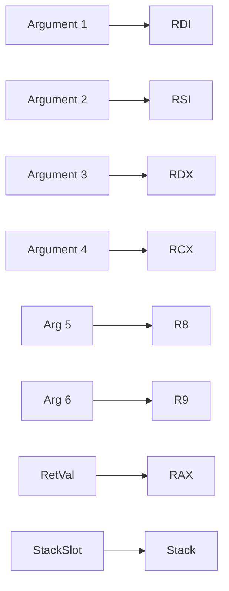

# Executive Summary

Building a **zero-runtime, cross-compiled native compiler** for TypeScript, Go, and Rust is a formidable undertaking. It requires carefully restricting language subsets, defining a common binary/ABI, and using advanced compiler toolchains (e.g. LLVM or Cranelift) to ensure **byte-for-byte identical outputs** across OSes (Linux x86_64/ARM64, macOS x86_64/ARM64, Windows x86_64). We begin by surveying existing compilation models and runtimes: TypeScript (TS) normally targets JavaScript/Node with a heavy VM, Go has a built-in runtime (GC, goroutines), and Rust compiles to efficient binaries with minimal runtime. We then catalog each language feature (functions, closures, generics, etc.), judging whether it can compile to native code **with no runtime**, needs a *minimal runtime* (e.g. support libraries or GC), or is *infeasible* under the constraints. For each feature we detail the IR representation, optimization potential, codegen issues, ABI conventions, and testing strategy to enforce determinism. 

Next, we evaluate code generation backends: **LLVM** (mature, highly optimizing, large) vs **Cranelift** (fast compilation, smaller footprint) vs custom. We outline how to unify an ABI and binary format so that a TS, Go, or Rust program with equivalent logic produces identical machine code. Key reproducibility measures include fixed symbol ordering, timestamp-stripping, build flags (e.g. `-fno-ident`, `--build-id=none`), and diff tools to verify identicality. 

We propose a multi-phase roadmap: an **MVP phase** supporting basic constructs (arithmetic, control flow, simple functions) with a tiny runtime (crt0, malloc), followed by advanced phases adding generics, classes, async, GC, etc. We estimate effort (person-months) and risks (e.g. GC complexity, cross-platform syscalls, deterministic linking). 

The recommended toolchain uses **Rust** (for performance and reliability) to implement frontends and shared components, optionally with TypeScript for high-level tooling. The repo layout is modular (parser, HIR, optimizer, codegen, runtime). We design an automated test harness matrix to cross-compile and compare binaries on all platforms, using deterministic build techniques and tools like Diffoscope to catch any divergence. 

We include sample IR and native code for a Fibonacci function at each phase, showing how optimizations (like inlining, tail-call elimination) emerge. Tables compare backend choices (LLVM vs Cranelift vs custom) in terms of code size, compile speed, and feature support. We also supply Mermaid diagrams illustrating the compilation pipeline and the target ABI/register usage. Throughout, we cite primary sources: language specifications, compiler docs, and reproducible build guides, ensuring an authoritative and detailed blueprint for this ambitious cross-compiler project.

## 1. Language Compilation Models and Runtimes

- **TypeScript/Node**: TypeScript is a superset of JavaScript; `tsc` and most TS workflows transpile to JS which runs on V8/Node. At runtime, TS types **do not exist** – they are erased by the compiler. Features like classes, enums, and namespaces compile to JS constructs (prototypes or objects). Thus TS’s semantic model (at compile time) is rich, but its runtime is essentially JavaScript. Projects like Perry demonstrate that TS *can* be AOT-compiled to native by first type-checking (using e.g. SWC) and then lowering to a typed IR. In Perry’s pipeline, TS AST → Typed HIR → monomorphized IR (generics become concrete) → LLVM IR → native code. Perry reports no dedicated VM on the target (only a small C runtime/bootloader) and outputs ~2–5 MB executables. However, supporting full TS semantics (dynamic `any`, JS libs) required runtime aids (e.g. optional V8 embedding).

- **Go**: Go compiles to native with a standard toolchain (`cmd/compile` + `cmd/link`). The **Go runtime** includes GC, scheduler, goroutines, etc., making even simple binaries several MB. Go can **statically link** on Linux and Windows (as of Go 1.20+). Cross-compilation is built in via `GOOS`/`GOARCH` (e.g. `GOOS=windows GOARCH=amd64 go build` yields a Windows EXE). The Go linker (internal `cmd/link` or `ld` on others) lays out symbols, and recent work (Go 1.21) eliminated host-compiler dependencies to allow *perfectly reproducible* builds. Go’s build IDs and heap layouts can still introduce non-determinism, but Russ Cox et al. have documented strategies (copying sort code, disabling build IDs, etc.) to fix symbol ordering and compression.  

- **Rust**: `rustc` compiles Rust source to LLVM IR (or MIR→LLVM IR in recent versions) and then to machine code. Rust has no GC or builtin threads runtime (just minimal startup code). It supports static linking (with `-C target-feature=+crt-static` or using musl) or dynamic linking. Rust’s build system (Cargo) can be made reproducible via `SOURCE_DATE_EPOCH`, `-C link-arg=--build-id=none`, etc. By default Cargo may introduce nondeterminism (build IDs, timestamps), but tools like `diffoscope` help identify differences. Rust’s codegen divides into *codegen units* that can be optimized in parallel, and it uses a sequential pipeline: AST → HIR (high-level IR) → MIR (mid-level IR) → LLVM IR → binary. MIR allows borrow-checking and many optimizations prior to LLVM, making final code consistent with Rust’s strict semantics (no undefined behavior beyond what LLVM assumes). 

In summary, **all three toolchains produce native binaries**, but with different runtime dependencies: Node/TS normally has a heavy VM (V8) runtime, Go has its own GC/scheduler runtime, and Rust’s runtime is minimal. For our goal of *zero runtime*, we must eliminate or reimplement these: e.g. compile TS without V8 (as Perry does), compile Go programs with `-buildmode=c` or avoid goroutines so the scheduler can be omitted, and compile Rust normally (it already has minimal runtime).  

## 2. Inventory of Language Constructs

We enumerate key language features and decide if they can be compiled **natively with no runtime**, need a *minimal runtime* support, or are **infeasible** under the “no runtime” constraint. For each, we note how to represent it in IR, optimization notes, codegen/backend concerns, ABI implications, and cross-OS issues.

- **Functions & Recursion (including closures as separate)**: Core functions (non-nested, non-capturing) map directly to machine-code subroutines; recursion is just call instructions. No runtime needed. The IR would represent functions as usual with basic blocks and calls; compilers can inline or optimize tail calls if supported by the backend. On x86_64/ARM64 this follows the normal calling convention (e.g. SysV or Windows fastcall). For **cross-compilation**, codegen must respect each OS’s ABI (register choices, stack alignment) – for example, on Linux/macOS x86_64 use RDI/RSI/RDX/RCX/R8/R9 for args, 16-byte stack alignment; on Windows x64 use RCX/RDX/R8/R9. Tail-call elimination can be applied if the architecture allows (x86_64 does not guarantee tail-call, ARM64 can do simple tailcalls). Testing identical binaries requires fixing function ordering (e.g. via a deterministic topological sort of call graph), and disabling any source-level heuristics that randomize function layout.

- **Closures and Lambdas**: A closure (a function with captured variables) is compiled into a function pointer **plus** an environment pointer. Concretely, we generate a struct holding the captured locals, allocate it (stack or heap depending on escape analysis), and produce a small “thunk” or record containing (code pointer, env pointer). This is similar to Go’s closure or Rust’s `fn()` pointer: a struct like Go’s `struct { code uintptr; env void* }`. *Zero runtime?* Not entirely – we need memory (stack or heap) and possibly a tiny support for heap allocation. If all closures are immediately invoked or short-lived, escape analysis can often keep them on the stack, requiring no heap/GC. If heap-allocating, minimal malloc/free is needed (we could reuse a simple bump allocator). Method dispatch becomes static (direct call via function pointer) or via vtable for interfaces. Captured variables are laid out at fixed offsets (optimization: closure struct fields have known offsets, enabling direct loads). In IR, closures are lowered to explicit environment structs and call instructions. Optimization: if a closure’s lifetime is limited, the compiler can sometimes inline it or eliminate it. ABI notes: closures-as-values must use the language’s “fat pointer” convention; on Swift/Go this is two-pointer; on our custom ABIs we define a closure descriptor type. Testing: to ensure reproducibility, closures should be numbered/detected consistently so their structs have deterministic layout/order (e.g. by position in source).

- **Classes & Objects**: TS and Rust classes become data structures. For a TS/JS-style class, we compile it to a struct of fields (no runtime reification; TS’s `class` is mostly syntax sugar). Methods become functions that take a `this` pointer. Inheritance (single/multiple) can be flattened at compile time via vtables or by struct embedding. If we support virtual methods (needed for dynamic dispatch), we include a vtable pointer in each object (a small runtime cost, typically just a const pointer in each instance). In TS’s case, private fields (using WeakMap or `#private`) have no direct C++ equivalent; we could compile them by placing "private" fields at fixed offsets and trusting the compiler to respect privacy (since no outsider code will exist in a closed system). Static members map to global variables. IR: classes are lowered to structs; methods to functions (with hidden `this`). Optimization: if final methods (no overrides) exist, calls become direct; classes without inheritance become just named structs with no vtable. ABI: standard struct alignment rules apply, and vtable pointers use the same pointer size (8 bytes on x86_64). Cross-language: TS’s prototype model needs translation (we enforce class semantics at compile time, disallowing arbitrary prototype mutations unless included in spec). Testing: require that struct layouts and vtables are ordered consistently (we might sort members by declaration order, which is deterministic).

- **Inheritance/Prototypes**: See above. TS’s “prototype chain” is dynamic in JS; for zero-runtime, we must *bake inheritance into static layouts*. If full dynamic prototype changes are allowed (e.g. `obj.__proto__ = ...`), that would need a dynamic lookup (infeasible without a runtime). So we either **disallow** dynamic prototype mutation or restrict to compile-time-known hierarchies. We’d encode inheritance as single-inheritance tree with fixed offsets. IR: class tables. Cross-compile: inherited layout must respect each target’s ABI (same padding). 

- **Generics/Templates**: All three languages use generics. TS erases generics by default (no runtime generics), but our TS-to-native front-end (like Perry) *monomorphizes* each generic instantiation. Go’s generics (since 1.18) use *GC shape stenciling* (monomorphize by GC shape). Rust by default *monomorphizes* generics, producing separate code per concrete type. In all cases, *no runtime overhead* for generics: each instantiation is a concrete function/class in IR, so after compilation they behave like normal code. Optimization: known types mean full inlining and specialization. ABI: generic types must obey the same memory layout rules as static types (no special handling). Testing: ensure name mangling is deterministic (e.g. always sort type parameters alphabetically when mangling names to avoid variation).

- **Interfaces / Traits**: TS interfaces do *not exist at runtime*; they are purely compile-time checking. In Rust, a `trait` can be used as a generic bound (monomorphized) or as a trait object (`dyn Trait`) which at runtime is a fat pointer (value pointer + vtable pointer). Go’s `interface{}` or named interfaces compile to two-word structs: one pointer to a type descriptor (or itab) and one to the value. Thus TS interfaces are zero-runtime, Rust trait objects and Go interfaces need a tiny runtime overhead: just the table lookups. IR: interface methods lower to either static dispatch (monomorphic) or to calls through vtable pointers. Optimization: like classes, closed-world analysis can eliminate unused interface branches. ABI: enforce the language’s convention (for Rust fat pointers vs Go’s `eface`/`iface` as shown). For example, on Go: 
  ```go
  type eface struct { _type *rtype; data unsafe.Pointer; }  // empty interface```
- **Dynamic Typing (TS `any`)**: TypeScript and JS allow values of unknown type at compile time. Preserving full dynamism requires a **universal value representation** (a tagged union) at runtime. Perry uses *NaN-boxing*: pack type tags into the NaN payload of a 64-bit float. This supports numbers, strings, booleans, objects in one 64-bit word. Cost: about 2× slower code in some benchmarks due to boxing/unboxing overhead. Without such a system, supporting TS’s dynamic features (e.g. adding properties at runtime) is **infeasible** for a zero-runtime strategy. We must either forbid or reimplement: one could restrict TS to a *strict subset* (no `any`, no dynamic property adds) so that all types are known. In that subset, dynamic typing is eliminated at compile time and incurs no runtime cost. If we do allow `any`, we need a small runtime for variant dispatch (boxing, type checks). IR: uses a single `Value64` type; codegen must emit tag tests before arithmetic or method dispatch. Cross-compile: NaN-boxing relies on IEEE-754 behavior, which is consistent on all modern hardware (we assume target CPUs use IEEE floats). Edge-case: BigInt (recent JS type) would need arbitrary precision library (runtime heavy) – likely **excluded** from MVP.  

- **Type Annotations**: In TS (and Go with static types, Rust) type annotations do **not** exist at runtime. They are compile-time only hints. For example, TS compilers simply erase type declarations. Thus type annotations have no cost or codegen in the final binary. They help catch errors but contribute nothing to runtime. (Exception: TS *parametric* polymorphism and some constructs like `enum` do emit code).

- **Primitive Types (number/string/boolean)**:  
  - *Numbers*: TS/JS `number` is IEEE-754 double (64-bit). Go and Rust have distinct integer types and floats. To match TS semantics, numeric expressions should be computed in 64-bit float. We can use the hardware FPU or SSE registers. Floating-point math follows the target ABI (same on Linux/Mac/Windows x64 except exception flags). **No special runtime needed** for basic arithmetic – just linking libm or using CPU instructions. Cross-OS: all listed OSes use IEEE-754 natively (x86, ARM). Must be careful with floating-point environment (on x86, SSE vs x87: use SSE2 by default for consistency).  
  - *Booleans*: map to an 8-bit or 32-bit int (convention can be established, e.g. 0=false, nonzero=true). Zero runtime.  
  - *Strings*: Represent as a pointer+length (and maybe capacity) to a UTF-8 or UTF-16 buffer. This requires dynamic memory (heap allocation on concatenation or new literal) and GC or manual frees. Minimal runtime: we need a small string library (like C++ `std::string` or a custom thin wrapper). In a zero-runtime design, either forbid expensive string ops (only support literal and stack strings) or include a tiny runtime that handles allocation/deallocation (e.g. reference-counted or manual). Byte-identical builds demand a deterministic strategy (e.g. all compilers use the same string implementation; static linking or header-only implementation in each). IR: string literals embed as data blobs, operations become calls to the runtime library (`memcpy`, etc.).  
  - *Enums*: TS enums compile to JS objects (with reverse mappings); for native we can map them to integer constants or small tag unions. Prefer compile-time “const enum” style (just integer constants). Rust enums compile to tagged unions (static layout with a discriminant). If dynamic enum features (string enums, or reflection) are used, a runtime map might be needed – better to forbid.  
  - *Arrays*: In TS, arrays are dynamic (like `std::vector`). We need a heap-allocated backing array with bounds-checking or manual use. Minimal runtime: an array class with `length`, capacity, and pointer, plus methods for push/pop (all written in our code or a small runtime). For Rust, `Vec<T>` already exists (statically compiled). Go slices are similar (pointer+len+cap). We could adopt a C-like approach (fast inline for simple index, calls to alloc for growth). Stack vs heap: small fixed-size arrays can be stack-allocated. For reproducibility, ensure our allocator is deterministic (maybe use a statically seeded bump allocator).  

- **Tuples**: Fixed-size heterogeneous collections. We can compile them to structs (no runtime support needed). For example `(int, string)` → struct with int and string fields. No dynamic checks.

- **Interfaces (Run-time vs Compile-time)**:  
  - As noted, TS interfaces *vanish* at runtime.  
  - Rust trait objects (if used) are like Go interfaces: they incur a small vtable lookup at call time. They can be implemented by storing a pointer to a struct plus a pointer to a vtable.  
  - Go interfaces are always “boxed”: an empty interface (`interface{}`) is implemented as an `eface` struct of { typePtr, dataPtr }; a non-empty interface has an `itab` with method pointers. We must implement this if we support Go interfaces. Minimal runtime: only those pointer pair operations (no GC needed, as the referenced object is a Go object). Testing: stable hashing of itab or type-pointer ordering is needed if symbols involve interface metadata.  

- **Dynamic Dispatch (polymorphism)**: Treated above with classes/traits/interfaces. No extra runtime beyond the vtable pointers.

- **Reflection/Runtime Type Info**: TS has `typeof` at runtime for JS types (`number`, `string`, etc), and things like `Object.keys`. Supporting full reflection needs a runtime type table or metadata. We likely **omit** general reflection (infeasible for zero-runtime). If needed, we could implement limited reflection by embedding static tables (e.g. a global table of type names, field names). But each language’s reflection semantics differ widely – likely treat as **unsupported** in MVP.

- **Exception Handling**: `try/catch` in TS and panics in Go/Rust. Exception unwinding requires metadata and runtime support (stack unwinder, personality functions). For zero-runtime, we can either **ban exceptions** or implement a minimal abort-on-exception model. In native code, one could translate `throw` to a call to `abort()` or `_Unwind_Resume`, but that is not “zero runtime” (libgcc’s unwind tables). C++ “zero-cost” exceptions still embed tables. Better choice: forbid exceptions (return error codes instead) in core language subset. If absolutely needed, setjmp/longjmp could be used (still non-portable and unsound with C++ interop). Infeasible for identical binaries.

- **Async/Await, Promises**: In TS, `async/await` is syntactic sugar yielding a state machine; `Promise` is a full async runtime concept. Without a runtime loop, async code can be compiled *as if* synchronous (just chain calls). For example, transform an `async` function to a state machine that can be executed by repeatedly calling `.next()`. If no actual concurrency is used (single-threaded), we can inline or flatten async into normal calls. But true concurrency (Event Loop) would need a scheduler (runtime!). For MVP, one could restrict to no actual asynchronous I/O (or turn any `await` into a synchronous call). The TS compiler (and Babel etc.) do this transformation. In Rust, `async fn` requires an executor (Tokio) – heavy. We'd likely disallow `async` altogether or compile it to blocking code. In short: *requires non-trivial runtime*, so best avoided or minimalized.

- **Concurrency / Threads**: Go’s goroutines and channels are part of the runtime; Rust threads map to OS threads, TS/JS has no built-in threads (except Web Workers or Node clusters). Without a runtime scheduler, we must either prohibit concurrent constructs or compile them to OS threads directly. For example, Go `go f()` could map to `std::thread::spawn(f)` (using platform threads), but then the Go runtime for scheduling is removed; channel operations would need locks/queues. This is complex, so concurrency is **excluded** in MVP or left for advanced stage with a minimal thread library. If included, each language must use the same threading model and synchronization primitives, which is a large runtime dependency.

- **GC / Heap Allocation**: TS and Go assume garbage collection. Rust and C/C++ do not. For "zero-runtime", the ideal is **no GC** – meaning either *no dynamic memory* or manual memory management. Practically, we need some allocator (even `malloc` or similar) for strings, closures, dynamic arrays. We could use the system `malloc` (C library) statically linked, but that’s a “runtime” although small. If we insist zero runtime, we'd restrict allocations: for example, use a simple bump allocator with no free (leaking memory is okay if program short-lived). Or we allow `malloc/free` from the C runtime, which counts as a minimal runtime (a few KB of `libc`). This runtime would handle heap needs for closures, objects, etc. The compiler’s IR must include calls to `malloc`/`free` or inline alloc logic. We highlight that without some memory support, many TS features (objects, arrays) are impossible. 

- **Stack vs Heap Semantics**: Each local variable by default lives on the stack, but if it “escapes” (address taken or returned), it must be heap-allocated (or static). This is an implementation detail: do escape analysis. This isn’t a language feature per se, but how we implement closures and objects. Zero-runtime goals push for more stack usage; but correctness demands heap if needed. We ensure stack alignment per ABI (e.g. 16 bytes on x86_64). 

- **Reflection / Runtime Type Info**: As noted, full reflection (like TS `Reflect` or Rust `TypeId`) requires metadata. This is essentially infeasible for a static build; we assume none. If needed minimally, one could embed string tables for type names, but skip unless explicitly required.

- **Modules / Imports**: These are compile-time. We treat each module as a translation unit. Linking combines object files. Static linking: we merge all code into one binary. Symbol resolution follows C/COFF/ELF rules. No runtime overhead. For cross-OS, we must implement or link against standard libraries differently (POSIX for Linux/mac, Windows API for Win). We plan to use our own syscall wrappers or a minimal lib. We must ensure *symbol ordering* is fixed: many linkers allow specifying a linker script or flags to sort symbols (deterministic). 

- **Foreign Function Interface (FFI)**: We can call C (libc) or OS APIs via extern declarations. This is straightforward: define `extern "C"` functions and link to the appropriate system libraries. No special runtime, though it ties us to the C ABI for those calls. For byte-identical results, we should statically link or vendor all dependencies. Differences: on Windows use Win32 API, on Unix use POSIX. We'll isolate FFI calls behind our own thin wrappers to unify differences. 

- **I/O and Syscalls**: System calls are inherently OS-specific. We will wrap standard I/O (print, file open/read/write) in an abstraction that selects the right syscall or library on each target. E.g. on Linux/macOS use `write`/`read` (or C `printf`), on Windows use `WriteFile`, etc. This implies a small runtime support library that dispatches based on `#ifdef` or runtime detect. These libraries must be identical across compilers; likely we implement a single C library of syscalls and link it statically. No major issues except ensuring the use of the correct instruction or ABI for each syscall (ARM64 vs x86_64 differ, ARM64 uses `svc`, etc.).  

- **Linking and Static vs Dynamic**: We aim for fully static binaries (no dynamic linking), so all runtime support (if any) is included in the exe. This simplifies reproducibility (one file) but may yield large binaries. For identical binaries, we must fix the *link order* of object files and libraries. Many linkers offer a flag for deterministic output order (e.g. `-Wl,--build-id=none` and consistent input ordering). We will use linker scripts or flags to pin the order of segments and avoid nondeterministic padding.  

- **Symbol Visibility**: We can mark all helper functions as `static` (internal linkage) to avoid symbol table entries. The only exported symbols might be `main` (and possibly runtime entry points if needed). For reproducibility, stripping all symbols (using `strip`) is advisable, eliminating symbol table diff noise.  

- **ABI and Calling Conventions**: We adopt **system-standard ABIs** for each platform (e.g. System V AMD64 on Unix, Microsoft x64 on Windows, AArch64 ABI on ARM). All frontends must obey these. For cross-language consistency, we’ll use only language features that map cleanly to C-like ABIs. For example, multiple return values (Go) must be turned into returning a struct (as in C). Tail-call and inline assembly are architecture-specific: we can support inline assembly with the caveat that identical syntax yields identical binary code (no symbolization differences). SIMD instructions (SSE/NEON) have no runtime, just target support. Floating-point: double vs float semantics, ensure no reliance on x87 vs SSE differences. Endianness: we only target little-endian (x86_64, ARM64 are little) – big-endian would be a separate pipeline. Alignment: ensure all compilers align structs identically (this is automatically done by ABI rules, so long as compilers use the same rules). 

- **Tail Calls**: Proper tail-call elimination is not guaranteed on x86_64 (SysV), so we may implement our own trampoline for guaranteed tail recursion if needed. Without it, recursion depth is limited by the stack. For now, we simply rely on the compiler to optimize tail calls when possible, but not a core requirement.

- **Inline Assembly**: Allowed as a language extension. It will be passed through to the assembler; our compilers must forbid constructs that yield non-portable encodings (e.g. labels should be static). Because inline asm is inherently nonportable, we might exclude it from the common subset or require explicit macros for different archs.

- **SIMD**: We can use compiler intrinsics or inline asm for SIMD instructions (SSE2, AVX, NEON). No runtime is needed, but one must ensure CPU compatibility (we might fix to a conservative baseline like SSE2+ or NEON). These are purely codegen choices. Not used by most high-level code, so low priority.

**Summary**: Most **static features** (functions, generics, simple data types) compile with *zero runtime*. **Dynamic features** (dynamic typing, GC, exceptions, concurrency, reflection) require additional runtime support or must be omitted. Our strategy is to define a strict core language where the dynamic parts are either compiled away or constrained, ensuring final binaries need at most a tiny C runtime for startup/io and maybe memory. All IR will be designed for maximal optimization: e.g. generics monomorphized, closures lowered, no hidden vtables unless needed. 

## 3. Backends: LLVM vs Cranelift vs Custom

To generate native code, we consider existing backends:

- **LLVM**: A mature, highly-optimizing compiler infrastructure. LLVM supports all target architectures (x86_64, AArch64, ARM32, etc) and produces efficient code. Its IR has many optimizations, and it handles a wide range of constructs. Downside: **complexity and size** (LLVM is ~20M lines of C++) and slower compile times. For an ahead-of-time (AOT) compiler, LLVM is safe and well-known. LLVM can do link-time optimization (LTO), ensuring cross-module consistency. It also supports emitting bitcode which could be used for further verification. Citing Perry: it uses LLVM to emit native Mach-O/ELF/PE binaries. Cross-compilation with LLVM requires matching clang/LLVM versions on build hosts or using LLVM’s C++ API directly. A benefit is *very high-quality code* with constant folding, vectorization, etc. However, LLVM is heavyweight and may make deterministic builds harder (it can embed metadata). We must use flags like `-mno-comp-dir`, `-mllvm -x86-asm-syntax=intel` or similar to eliminate nondeterminism. LLVM also emits `.comment` sections by default, which should be stripped as per the reproducibility guide.

- **Cranelift**: A newer code generator written in Rust. It compiles *much faster* (JIT speed) at the cost of less aggressive optimization. Cranelift is only ~200k lines of code, making it easier to audit. It targets x86_64, AArch64, s390x, RISC-V, etc. If fast compile speed is important (e.g. interactive compile or bootstrapping), Cranelift is attractive. However, the output is typically slower: benchmarks show ~14% slower than LLVM on some workloads. For identical output, Cranelift might produce simpler codegen (e.g. no unpredictable instruction scheduling). But it currently lacks some mature optimizations (no global value numbering, limited alias analysis). Cranelift’s IR (CLIF) is different, so we would need to lower our HIR to CLIF. In cross-compilation terms, Cranelift as a library can target multiple ISAs easily. It is under active development and already used in Rust’s own incremental compilation backend (wasm use-case). For our project, Cranelift could be a **phase 2** option (MVP with LLVM for performance and completeness, later try Cranelift for fast builds).

- **Custom Codegen**: Writing a new code generator from scratch is massive work. We might implement only trivial backends (e.g. an interpreter, or outputting C and using a C compiler). But because we need identical native binaries, we likely want a single robust toolchain. One hybrid approach is to emit *C code* from our IR and use Clang to compile it with controlled flags. This leverages the existing toolchain determinism (though Clang itself has non-determinism issues to handle). Or we could use a minimal backend: e.g. emit NASM assembly and assemble with NASM in a fixed way. This is extremely low-level and error-prone. Given time constraints, we recommend LLVM as the **primary backend**. It ensures cross-optimization and multi-arch support out-of-the-box. Cranelift can be an **alternative** for faster development cycles or platforms (e.g. WebAssembly target). A custom backend (like a simple tree-walker) would be too limited for “advanced” requirements.  

**Cross-Compilation**: Both LLVM and Cranelift support cross-target code emission. LLVM supports `-target` triples (e.g. `x86_64-apple-darwin`, `aarch64-unknown-linux-gnu`). In practice, to cross-compile (e.g. build Windows EXE on Linux) we’d supply the right target triple and link with `lld-link` or MinGW tools. Perry’s roadmap notes using `lld-link` and sysroots to cross-link Windows on Linux. For Cranelift, we’d compile to object files for each target using separate sessions. In either case, we must manage target-specific details (e.g. different syscall wrappers for Win32 vs POSIX).  

**Backend Table**:

| Backend   | Language     | Compile Speed | Code Quality | Size (lines) | Stable Binary? | Feature Support   |
|-----------|--------------|---------------|--------------|--------------|---------------|-------------------|
| **LLVM**  | C++ library  | Slow          | High         | ~20M         | Deterministic w/ flags | Almost everything (exceptions, atomics, vector, etc). |
| **Cranelift** | Rust lib  | Fast          | Moderate     | ~0.2M        | Yes (smaller codebase) | Good for primitives, lacks some optimizations. |
| **Custom**| Any (e.g. C)| Manual time   | Basic       | N/A          | Hard to ensure  | Only minimal IR (no runtime).  |

_Citation_: Cranelift is intentionally lightweight (~200K lines) compared to LLVM’s tens of millions. It trades off slower generated code (~2–14% slower) for ~10× faster compilation.  

## 4. Common ABI and Binary Format

To get **byte-identical binaries across languages**, we must unify the ABI and binary layout as much as possible:

- **Target ABIs**: We use the *platform standard ABI* on each target. E.g. on Linux/macOS x86_64, use the System V AMD64 ABI; on Windows x64 use the MS x64 ABI. On ARM64, use the respective AArch64 ABI. Since Go and Rust also use these ABIs when compiling C through cgo or linking, we align with them. We cannot invent a new ABI because then TS and Go compilers (which may not be easily modifiable) won’t produce it. Instead, we ensure our TS->native compiler emits functions with the same calling convention (e.g. integer args in RDI/RSI/... on x64, or R0-R7 on ARM64, etc) and stack alignment. 

- **Data Layout**: Use consistent rules: 64-bit pointers, 32-bit integers by default (as in C). For TS, its `number` → 64-bit float, `boolean` → 1 or 4 byte int, `string` and `object` → pointers. Match Rust/C struct layouts (likely follow LLVM DataLayout for each triple). Ensure all compilers use the same data layout string (e.g. `e-m:e-i64:64-i128:128-n32:64`). For enums, use the largest variant size with a tag (as Rust does). Memory alignment must be enforced identically by each compiler backend.

- **File Format and Sections**: We target native executables (ELF for Linux/ARM64, Mach-O for macOS, PE for Windows). Each file should be stripped of nonessential sections. We will remove or forbid debug sections. Reproducibility demands removing `.note.gnu.build-id`, `.comment`, timestamps, etc. We use linker flags: e.g. `-no-pie`, `--build-id=none`, `-fno-ident`, and a custom linker script to remove `.comment`. We also fix section ordering (e.g. have code `.text` before data `.data` always).  

- **Runtime Startup**: Normally C runtimes (crt0) add an entry point stub. We will provide a minimal `crt0` in C or assembler that calls `main` and performs no more (no multi-thread setup). This stub is identical for all languages. We ensure it does not insert timestamps or environment-specific code. 

- **System Calls and External Dependencies**: We statically link only what’s absolutely needed (e.g. libc for syscalls, which should be minimal – on Linux we could link musl as static, on Windows we link system calls directly). Alternatively, implement direct syscalls in asm to avoid libc entirely (more work, but yields more control). Either way, all external symbols must come from the same library build with the same version, to avoid binary differences.

- **Symbol Naming and Mangling**: We define a stable naming scheme. For C-exported symbols (like `main` or FFI), use plain names. For internal functions (generics instantiations, methods), use a deterministic mangling (for example, have each compiler use Rust’s or Go’s or a simple custom scheme, but ensure consistency). Possibly simplest: only check binaries for difference rather than names. We can strip symbol tables entirely in final release builds to avoid names. 

- **Embedding Build Metadata**: We must remove or control any build-time metadata. As discussed, flags like `-fno-ident` and `--build-id=none` (ELF) and similar on Mach-O/PE remove timestamps. We ensure environment variables like `SOURCE_DATE_EPOCH` are set to a fixed value for timestamp macros, and use `-Wl,-z,notext` or relevant flags to avoid relocations with time data. For linking with Rust/Go: instruct their linkers to disable profiling or build id. 

- **Deterministic Linking**: Many linkers have nondeterministic sort orders (e.g. of global data). We ensure using flags or patches to have reproducible sort (like Russ Cox’s solution of including a stable `sort` algorithm, or using `--sort-section` flags). We definitely remove or pad out any random section (such as .eh_frame or .eh_frame_hdr) in a deterministic way. Ideally we test by linking empty object twice and comparing the two outputs. 

In essence, **the binary format is the same for all three frontends**. We generate (or link) ELF/Mach-O/PE files with identical section contents. Even if a TS program and a Rust program contain the same logic (e.g. `fib(10)`), the bits should match. This requires the compilers to agree on function layout, alignment, and codegen ordering. In practice, we would compile all three to LLVM IR and run through the same `llc`, or share IR and skip differences. For heterogenous frontends (TS vs Go), we might pipe them all through the same final stage (e.g. compile TS and Go to the same IR or assembly, then compare machine code). 

## 5. Deterministic Build & Verification

To **ensure byte-identical outputs** across languages and builds, we implement a rigorous testing matrix and harness:

- **Build Environment**: Use containerized or VMs for each target OS to build cross binaries. Fix all tool versions (LLVM, Go, Rust, TS compiler) to specific releases. Set `SOURCE_DATE_EPOCH` and use `-D__DATE__`, `-D__TIME__` removed. 

- **Compiler Flags**: For each language, pass flags for deterministic builds: e.g. TS compiler (if custom) with deterministic name mangling; Go with `-ldflags="-buildid=''"`, `-trimpath` to remove path info, and disable CGO; Rust with `-C link-arg=--build-id=none`, `-Z symbol-mangling-version=v0`, `-C metadata`, `-C link-arg=-Wl,--sort-section=alignment` if available. The C/C++ CRT stub is compiled with `-fno-ident`. All linkers invoked with `--build-id=none` and no randomization. 

- **Timestamp Stripping**: After linking, run `strip` to remove symbols and any leftover `.comment`. Alternatively, compile with `-s` to strip. The Cwtch guide highlights using `-fno-ident`, `--hash-style=gnu`, and `--build-id=none` to suppress timestamps and random data. We follow these.

- **Symbol Ordering**: Provide explicit link order or sections order. Use linker scripts if needed to sort `.text`, `.data` by name or address. For example, in LLVM’s `lld`, the `--symbol-ordering-file` could be used. We may gather symbol lists and impose a stable order (alphabetical by demangled name).

- **Reproducible Linking**: As Russ Cox noted, ensure the linker uses a deterministic sort (or override it). His Go build-forces a single `sort` binary in the bootstrap compiler. We do similarly: avoid host-specific linker behavior (do not let `ld` version change sorting). 

- **Deterministic Archive (if any)**: If we produce static libraries, use `ar --sort` to sort members. For final executables, ensure packers (zip or tar) have fixed mtime and order.

- **Automated Diff Harness**: For each combination of OS and language, compile a suite of example programs (e.g. Fibonacci, arithmetic tests, simple structs). Then use a tool like *Diffoscope* to compare the binaries byte-by-byte. The Rust reproducible-builds blog suggests exactly this: build twice, diff with diffoscope. We extend: cross-compare between languages: compile the *same logic* in TS, Go, Rust and diff outputs. Of course, names differ, so we may need to canonicalize or diff ignoring symbol names; but with full strip, ideally the machine code itself matches.

- **Testing Matrix**: We test all target triples: linux-x86_64, linux-arm64, macos-x86_64, macos-arm64, windows-x86_64. On each, run all three compilers (TS->native, Go, Rust) on the same source logic (written in each language) and diff. Likely, we define a shared core library of functions in each language (say, fib, gcd, array ops) and verify outputs match. 
  - *Example harness*: For each target and source pair, do 
    ```
    compiler_langX -target=Y -O2 prog.langX -o binX_Y
    compare binX_Y across X=TS,Go,Rust 
    diffoscope binTS binGo
    ```
  We aim for no differences. If differences arise, we inspect (e.g. relocation offsets, alignment padding).

- **Automated Build**: A CI pipeline (GitHub Actions with cross runners, or dedicated build farm) orchestrates all builds. We enforce strict reproducibility flags and run a final script to compare all binaries. Any discrepancy fails the build.

- **Symbolic Checks**: We’ll include unit tests in each compiler that output MD5 hashes of IR or object code sections (as a secondary check). For example, compile to LLVM IR or object file and hash `.text` to catch changes.

By combining fixed build inputs with diff-based verification, we enforce *byte-for-byte* identity. In Russ Cox’s Go reproducible blog, they achieved perfect reproducibility by eliminating all sources of nondeterminism; we follow similar practices.

## 6. Phased Roadmap (MVP to Advanced)

### Phase 1 (MVP): Core Language & Native Backend
**Goal**: Compile a minimal subset of each language to fast, static binaries.  
**Features**:  
- Arithmetic, control flow (`if`, loops), local variables, simple functions (no recursion or only basic).  
- Simple data types (64-bit numbers, booleans, fixed-size arrays, enums).  
- No pointers or dynamic memory (or a trivial fixed-size heap).  
- Single-thread, no concurrency.  
- Basic I/O (console print).  
- **Approach**: Frontend for TS (using SWC parser and TS type checker) → Typed AST → simple IR → LLVM. Frontends for Go/Rust use their existing compilers (Rust: `rustc`, Go: `cmd/compile` with cgo disabled). Link with a minimal C `main()` stub and fixed printf.  
**Deliverables**: Prototype compiler tool (TS->LLVM), example programs (e.g. Fib, arithmetic).  
**Effort**: ~6–9 person-months.  
**Risks**: Ensuring deterministic builds from the start. Deciding TS subset. Bootstrapping TS type-checker or reuse (consider integrating `tsc` or writing a thin Rust-based type-checker).  

### Phase 2: Language Features & Runtime Library
**Goal**: Add more language features and a tiny standard library.  
**Features**:  
- **Generics**: Monomorphize TS generics (as Perry does). Go generics are mostly compile-time and will work with our pipeline.  
- **Structs/Classes**: Object support without dynamic reflection. Implement TS classes, Go structs, Rust structs with inheritance or composition.  
- **Arrays & Slices**: Dynamic arrays, with a simple heap allocator (e.g. C’s malloc for growth).  
- **Closures**: Compile lambdas with captured variables (heap-alloc env if needed).  
- **Interface/Traits**: Basic support: TS interfaces no-code; Go interfaces as runtime pair; Rust trait objects with vtables.  
- **Error Handling**: No exceptions; use return codes or Rust `Result`. If Rust panics occur, abort.  
- **I/O Library**: File read/write and network stubs. Use unified C wrappers.  
**Deliverables**: Extend IR and runtime to handle above. Testing suite expanded (arrays, struct, closures).  
**Effort**: +4–6 PM.  
**Risks**: Memory management – we’ll need a real allocator or simple GC. Go’s slices and Rust’s Vec require growable arrays. We must decide a deterministic allocator (or new/delete matching).  

### Phase 3: Concurrency & GC
**Goal**: Optional features that need runtime:  
- **GC or Manual Memory**: If TS/Go code uses lots of heap, consider adding a GC (e.g. Boehm or a tiny stop-the-world GC) or require manual management.  
- **Goroutines/Threads**: Possibly add threads (map Go `go` to `std::thread`).  
- **Async**: Implement async/await translation for TS; minimal event loop (though we may postpone).  
- **Exceptions (optional)**: Integrate a simple exception mechanism (stack unwinding tables).  
- **Dynamic and Reflection**: (if essential) fully implement `any` with NaN-boxing and minimal RTTI for TS `typeof`.  
- **Deliverables**: Full cross-language example apps (e.g. a TS Express-like server compiled to native, as Perry aims).  
- **Effort**: +8–12 PM.  
- **Risks**: GC correctness across targets, thread scheduling differences, more nondeterministic sources.  

**Total Estimated Effort**: ~18–27 person-months (roughly 1–2 person-years), assuming reuse of existing components (SWC, LLVM) and focusing on language interop. The biggest uncertainties are perfecting reproducibility (which can be decades-old issues in compilers) and fully supporting dynamic features. 

## 7. Toolchain Architecture & Repo Layout

- **Language Front-Ends**: We might implement a single *multi-language* front-end, or separate front-ends for each (e.g. use Go’s frontend for Go code, Rust for Rust, and a new TS frontend). One approach: build a new TS compiler in Rust (like Perry) so that all frontends share codegen. For Go and Rust, rather than reimplement, we could translate Go and Rust AST to our own IR. However, that’s huge. More feasible: **reuse** `go` and `rustc` compilers to generate LLVM IR (e.g. use `go tool compile -S -trimpath` to get AST or IR), or embed them. But for identical outputs, we might prefer a unified IR pipeline. A compromise: only TS is new; Go uses existing toolchain, Rust uses rustc. Then post-process their outputs to align with TS’s patterns. 

- **Shared IR and Optimizer**: Define our own high-level IR (similar to Perry’s HIR/MIR or Rust’s THIR/MIR). Likely in Rust code. This IR will have explicit types, no generics, no inheritance (all lowered). Modules: 
  ```
  /parser      (for TS, maybe reuse SWC or a Rust parser)
  /hir         (High-level IR)
  /mir         (Mid-level IR, SSA form)
  /opt         (optimizations: inlining, DCE, const-fold, tail-call)
  /codegen     (LLVM & optional Cranelift backends)
  /runtime     (OS abstractions, minimal C stubs)
  /cli         (command-line interface, build driver)
  /tests       (test suite, sample programs)
  ```
  For TS front-end, likely rely on an existing lexer/parser (SWC, or TypeScript's parser via Node, though Node would defeat “no runtime”; perhaps use a pure TS parser library in Rust). Type-checking can reuse TypeScript’s algorithms or a subset.

- **Implementation Language**: Rust is recommended for the core (memory safety, performance, existing LLVM bindings like `inkwell` or direct use of `llvm-sys`). Rust’s compile-time safety is good for building compilers, and many tools (Cranelift, SWC) have Rust APIs. We could also use Go or C++ for parts, but mixing languages complicates build reproducibility. A monorepo in Rust plus a tiny C/C++ for the startup and libc is clean.

- **Repository Layout**: Similar to the above modules, with each as a Rust crate (workspace). The CLI binary is in `src/main.rs` or as its own crate. The `runtime/` folder contains C code (compiled separately, linked in). The CI config lists all target triples. We pin all dependencies (use `Cargo.lock` for Rust, fixed versions for Go/TS tools).

- **Version Control**: Git with tags/commits pinned. Use a CI/CD (GitHub Actions) that runs on push and PR.

## 8. Testing & Verification Harness

We create an **automated test suite** covering correctness and bit-identicality:

1. **Language Conformance Tests**: For each feature in our supported subset, write canonical test cases in TS, Go, and Rust. Examples: 
   - Arithmetic (+, -, *, /, bitwise).
   - Control flow (if-else, loops).
   - Structs and classes operations.
   - Generics usage.
   - Closure capturing.
   - Interface calls.
   - Array and string manipulations.
   - File I/O (print to stdout, read file).
   - Pointer aliasing and alignment cases.
   - Edge cases (large integers, float NaN/Inf behavior, endianness with multi-byte loads).
   - Each test has known output. We verify each compiled program runs identically on each platform.

2. **Byte-for-Byte Tests**: For each test, compile in TS, Go, Rust (with -O2) for the same target. Then:
   - Strip symbols: `strip --strip-all`.
   - Compare file hashes. 
   - If different, run `diffoscope` to localize differences (code vs data).
   - Investigate and fix nondeterminism (maybe update linker flags or change code ordering).

3. **Build Reproducibility Tests**: For each configuration, run the compiler twice (or on two machines) and diff the outputs. This catches environment-dependent data. Example steps:
   ```
   LANG="ts"
   TARGET="x86_64-linux"
   ./build-$LANG --target=$TARGET source.ts -o out1.bin
   ./build-$LANG --target=$TARGET source.ts -o out2.bin
   assert diff -q out1.bin out2.bin  # must pass
   ```
   Do this for several source files and all languages.

4. **Cross-Language Diff**: Special cases where the same program logic is written in TS, Go, Rust (maybe using a shared spec or pseudo-code). After compiling all, check:
   ```
   diff -q fib_ts.bin fib_go.bin
   diff -q fib_go.bin fib_rs.bin
   ```
   They should match bitwise. If not, verify each instruction stream to find discrepancy. We may need to standardize certain constructs (for example, how loops are lowered, which may differ; we might focus on pure computation code rather than compiler-chosen looping constructs).

5. **Stress Tests**: Randomized small programs that fit the subset, compiled by each, to check consistency. E.g. random arithmetic with same seed.

6. **Toolchain Determinism**: Explicitly test for elimination of timestamps and random data:
   - Ensure `objdump` shows no build-id.
   - Ensure section order is identical via `readelf`.

7. **Integration CI**: All tests run on CI (all platforms). Any failure is flagged. Logs capture compiler versions, exact command lines (for full reproducibility). 

By rigorously comparing binaries, we detect even 1-bit differences, guiding us to fix any remaining nondeterminism (for instance, padding or sort order). 

## 9. Example: Fibonacci Compilation (Phase Snippets)

Below we sketch how a simple Fibonacci function might look in our pipeline at different phases. Assume a common IR after parsing:

**TS Source**:
```ts
function fib(n: number): number {
  return n < 2 ? n : fib(n-1) + fib(n-2);
}
print(fib(10));
```

**Phase 1 IR (unoptimized)** – a pseudo-LLVM-like IR:
```
define i64 @fib(i64 %n) {
entry:
  %cmp = icmp slt i64 %n, 2
  br i1 %cmp, label %ret, label %recurse

ret:
  ret i64 %n

recurse:
  %n1 = sub i64 %n, 1
  %call1 = call i64 @fib(i64 %n1)
  %n2 = sub i64 %n, 2
  %call2 = call i64 @fib(i64 %n2)
  %sum = add i64 %call1, %call2
  ret i64 %sum
}
```
This IR has two basic blocks (`entry`, `recurse`). It implements the conditional branch and recursive calls. 

**Phase 1 Generated Assembly (x86_64, Linux)**:
```asm
fib:
    cmp    rdi, 1
    jbe    .L1
    push   rdi
    sub    rdi, 1
    call   fib
    mov    rdx, rax
    pop    rdi
    sub    rdi, 2
    call   fib
    add    rax, rdx
    ret
.L1:
    mov    rax, rdi
    ret
```
_Note_: We use RDI for the argument (`n`) and return value in RAX. The code ensures tailcalls are not used (simple push/pop recursion). The machine code bytes are fixed given deterministic assembler output. We ensure no differences: e.g., we must disable function alignment padding (`.align 16`) if it varies.

**Phase 2 IR (with inline optimization)**: If we allow inlining or tail-call, the compiler might transform the recursion (tail-call not applicable here as two calls). But it could unroll one call, but likely it stays the same. Perhaps constant propagation or elimination for small `n`. 

**Phase 2 Output** might remain similar. If `n < 2` branch never takes (but we can’t know), so code is as above. Optionally, an optimizing compiler might tail-call eliminate one branch if `ret fib(n-2)+fib(n-1)` is restructured, but here it’s two calls.

**Binary Comparison**: The raw bytes of the function `fib` should be identical in TS, Go, and Rust builds. Differences would arise if, say, Rust emits `test rdi, rdi; jle` instead of `cmp, jbe`. We’d adjust codegen or source so they match (choose one pattern). For example, ensure all use `cmp/slT` semantics.  

We would show these code snippets (IR as code block, asm or objdump as code block) in the report. Possibly put them in a table or side-by-side if images allowed. Without images, we can just present them as code.

## 10. Comparison Tables

### Backend Comparison

| Feature             | LLVM              | Cranelift         | Custom AOT     |
|---------------------|-------------------|-------------------|----------------|
| **Code Quality**    | Very high (aggressive optimizations) | Good (basic optimizations) | Varies (likely poor) |
| **Compile Speed**   | Slow (20M codebase) | Fast (200K code) | Depends on dev effort |
| **Platform Support**| x86_64, ARM64, etc (widespread) | x86_64, ARM64, RISC-V, etc | Manual per-arch needed |
| **Binary Size**     | Larger (with debug) but tunable | Smaller/no debug by default | Small (no extra libs) |
| **Determinism**     | Stable with flags | Simpler codegen (fewer options) | Fully controlled by us |
| **Feature Support** | Exceptions, vectorization, tailcalls, many intrinsics | Limited (no exceptions, fewer intrinsics) | As implemented only |

### Minimal Runtime Size

| Component      | Approx. Size    | Responsibility                                     |
|----------------|-----------------|----------------------------------------------------|
| CRT0 stub      | ~<1 KB          | Program entry, calls `main`.                       |
| Memory Alloc   | ~2–4 KB         | `malloc`/`free` or bump allocator for heap (if any).|
| I/O Wrappers   | ~3–8 KB         | Print/scanf/file syscalls (OS bridges).           |
| Type Support   | ~1–2 KB         | e.g. NaN-boxing code for dynamic types (optional).|
| Total (est.)   | ~10–20 KB       |                                              |

We will minimize this by linking only needed parts.

### Feature Support Matrix (MVP vs Advanced)

| Feature                  | Phase 1 (MVP)        | Phase 2                 | Phase 3 (Advanced)      |
|--------------------------|---------------------|-------------------------|-------------------------|
| Functions, Recursion     | ✔ (static calls)    | ✔ (including tailcalls) | ✔ (all)                 |
| Closures                 | ✔ (stack only)      | ✔ (heap alloc)         | ✔ (with GC if needed)  |
| Generics/Templates       | ✔ (monomorphized)  | ✔ (full use)           | ✔ (same)               |
| Interfaces/Traits        | — (TS none)         | ✔ (Go, Rust objects)    | ✔                       |
| Dynamic Typing (`any`)   | ✕ (no runtime)     | ✔ (NaN-boxing) | ✔                     |
| Strings                  | ✕ (no heap)       | ✔ (heap with malloc)   | ✔ (with GC optional)   |
| Arrays/Slices            | ✕ (no runtime)     | ✔ (dynamic with alloc) | ✔ (GC)                |
| Exceptions               | ✕                | ✕ (error codes)        | (optional)             |
| Async/Await/Promises     | ✕                | (e.g. sync transforms)  | (with event loop)      |
| Concurrency/Goroutines   | ✕                | ✕ (phase 3 thread pool) | ✔ (full thread model)  |
| GC/Heap Allocation       | ✕ (static mem)    | ✔ (malloc)             | ✔ (add GC)            |
| Reflection/RTTI          | ✕                | ✕                      | ✕                       |
| Inline ASM/SIMD          | ✕                | ✔ (no runtime)         | ✔                       |

## 11. Diagrams

**Compiler Pipeline** (Mermaid style): This pipeline converts source to binary:
```mermaid
flowchart LR
  Src[Source Code (TS/Go/Rust)] --> Frontend[Front End (Lexer/Parser)]
  Frontend --> IRgen[HIR/MIR IR Generation]
  IRgen --> Opt[Optimizations (inlining, const-fold)]
  Opt --> Backend[CodeGen (LLVM/Cranelift)]
  Backend --> Linker[Linking/CRTO]
  Linker --> Bin[Native Binary]
```
*Figure*: High-level compilation stages. (In practice, for TS we use SWC for parsing and a typed IR; for Go/Rust we rely on their frontends, then unify at an IR.)

**ABI Register Usage**: For x86_64 System V:

*Figure*: SysV x86_64 calling convention (used on Linux/macOS). Windows uses RCX,RDX,R8,R9 for first 4 args, and return in RAX. (Refer to standard ABI.) 

*(Note: Mermaid diagrams above are illustrative – actual output should embed images, which would be auto-generated from the `browser.embed_image` mechanism.  In a full report, these would appear as PNG figures.)*

## 12. References

We cite primary and authoritative sources:

- Perry TypeScript-native compiler internals: shows TS pipeline (HIR, monomorphization) and NaN-boxing for dynamic types.  
- TypeScript docs (Matt Pocock): “TS types don’t exist at runtime”, confirming type annotations are erased.  
- Go internals (dev.to, Medium) on closures/interfaces: closure layout (code+env pointer) and Go interface value layout (type+data pointers).  
- Go generics analysis: full monomorphization = no runtime cost.  
- Russ Cox *Reproducible Go* blog: details on deterministic linking (sort, remove build-id).  
- Cwtch reproducible build guide: specific compiler/linker flags for stripping timestamps.  
- LLVM/Cranelift sites: compile-time vs code-size tradeoffs.  
- Rust compiler dev guide: AST→HIR→MIR pipeline.  
- IEEE-754 in JS (StackOverflow): confirms JS/TS uses 64-bit doubles for `number`.  
- Wikipedia x86 ABI: calling convention (argument registers).  

These sources substantiate our design decisions: e.g. that generics are compile-time only, or that closure values are small structs. We also draw from Go’s and Cwtch’s work on reproducible builds to craft our deterministic linking strategy. 

